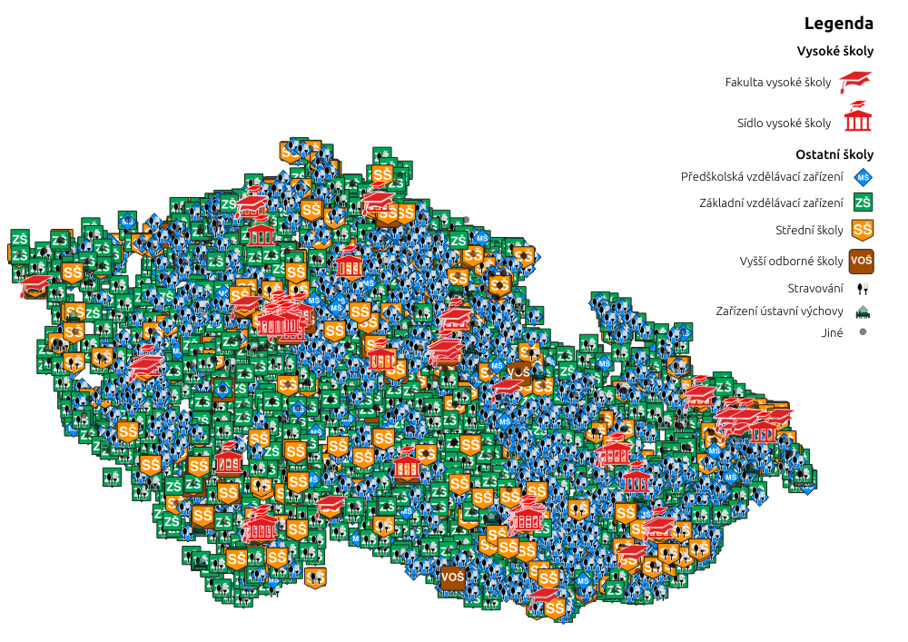
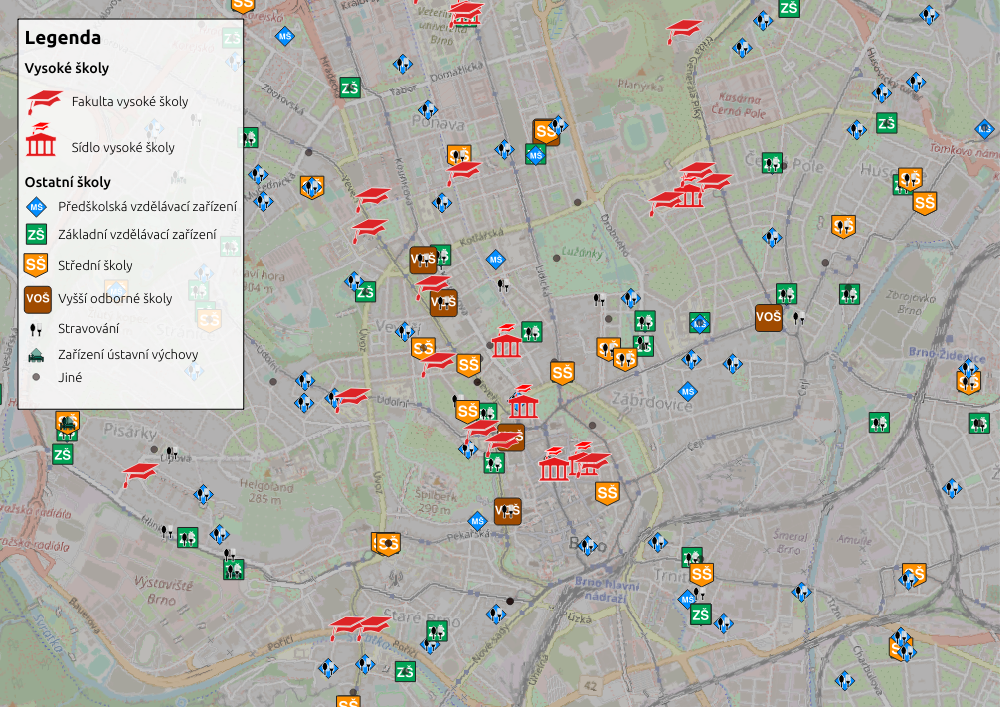

# czech_educational_institutions
*EN:* **Location and capacity of almost every educational institution in Czech Republic**

*CZ:* **Umístění a kapacity téměř všech vzdělávacích zařízení v České republice**




## Data description
#### Schools
- `id`: ID of the entity
- `type`: code of the educational institution's type
- `name`: name of type or name of the educational institution
- `city`: name of the city or town of location
- `street`: street name, if provided
- `lrn`: land registry number (číslo popisné)
- `hn`: house number for orientation, if exists (číslo orientační)
- `city_part`: part of the city, if applicable
- `zip_code`: postal code of the area
- `foreign_lg`: foreign languages that are taught in the school, if provided
- `capacity`: maximum capacity of the institution
- `address`: address string

#### Universities
- `code`: ID of the entity
- `type`: entity type (*university*, *faculty*, *other*)
- `university`: name of the university
- `faculty`: name of the faculty within university
- `other`: name of other building within university 
- `total`: full count of students in the entity
- `ft_total`: total count of full-time students
- `ft_bach`: count of full-time bachelor students
- `ft_master`: count of full-time masters students
- `ft_fmaster`: count of full-time follow-up masters students
- `ft_phd`: count of full-time PhD students
- `dc_*`: same as above for distant and combined form students
- `address`: address string
- `private`: `0` if state-owned and `1` if private

## Download
If you are only up to the data, just download the archive or particular file of interest.
Shapefiles `schools/schools.shp` and `universities/universities.shp` can be opened using e.g. QGIS or ArcGIS Pro. There is already a QGIS project `view_edu.qgs` (for QGIS > 3.28) to use with the data right away (looks like in the pictures above)

## Setup
If you need to re-run the script to obtain more recent data, do the following.
Ideally, you should create virtual environment. Open the Terminal in the folder with the script and run: 
```
python -m venv "</path/to/new/virtual/environment>"
source "</path/to/new/virtual/environment/bin/activate>"
pip install -r requirements.txt
```
Then launch the script with arguments:
```
python czech_educational_institutions.py -u "<path to save universities shapefile (.shp)>" -s "<path to save schools shapefile (.shp)>" -c <path to save schools table (.csv, optional argument)> -p <number of processes to launch when scrapping MSMT web, integer, optional> -C <output CRS of shapefiles, like epsg:5514, optional>
```
## Run
To run the script, Firefox browser needs to be installed and be accessible through PATH variable
Processes number should be calculated with respect to available RAM, one process consumes approximately 550MB of RAM. Default value equals to the number of cores (which doesn't have to be representative on your system)

## Compatibility
Script was developed and tested on Linux (Ubuntu 22.04.2), will potentially work on macOS, **but not on Windows**, because of the issue with multiprocessing pool (function to run in different processes should be imported from different file).

## Credits
All the data come from the [Ministry of Education, Youth and Sports](https://www.msmt.cz/?lang=2)